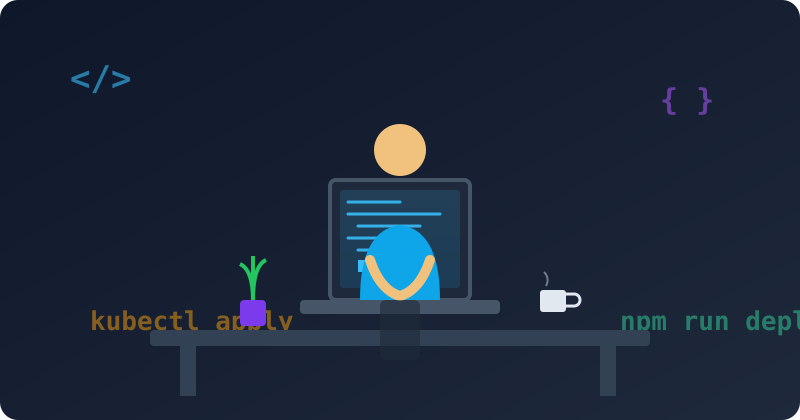

 

  I build practical, production-grade software — from fintech and healthtech platforms serving Nigerian communities, to automated infrastructure that keeps things running.

 

## 🧭 About Me

- 🔭 Currently rebuilding **WardLink NG**, an offline-first clinical handoff app, from a phone-only dev workflow
- 🌍 Focused on financial inclusion and healthcare access across Nigeria
- 🛠️ Comfortable across the stack: frontend, backend, databases, and the infrastructure that ships it all
- 📱 Yes — I build production systems entirely from an Android device (Acode + Alpine proot, no local Docker/Terraform/Helm binaries)
- ⚡ Fun fact: I've debugged Kubernetes and Terraform without ever opening a laptop terminal

 

## 🔧 Tech Stack

  

 

<table align="center">
<tr>
<td valign="top" width="33%">

**Languages & Frameworks**

</td>
<td valign="top" width="33%">

**Infrastructure & DevOps**

</td>
<td valign="top" width="33%">

**Data & Auth**

</td>
</tr>
</table>

 

## 🚀 Featured Projects

### 💰 [AjoSave](https://github.com/Gr8vybs/Ajo-save)
**A peer-to-peer digital savings platform** inspired by traditional Nigerian *ajo/esusu* community savings groups — built for traders and unbanked populations in Abuja.

`Next.js 15` `NextAuth v5` `Prisma` `SQLite` `TypeScript` `Tailwind CSS`

- 📊 Trust score visualization for group members
- 🔗 Invite-code based group joining
- 💸 Contribution tracking and automated payout rotation logic

---

### 🏥 [WardLink NG](https://github.com/Gr8vybs/WardLink-NG)
**An offline-first clinical patient handoff tool** built to improve continuity of care in Nigerian hospitals, even in low-connectivity wards.

`React Native (Expo)` `NestJS` `PostgreSQL` `Redis + BullMQ` `Terraform` `Docker` `Kubernetes`

- 🔄 Offline-first sync using hybrid logical clocks and an operation log, with server-side conflict detection
- 🔐 Row-Level Security for hard multi-tenant facility isolation
- 📋 Structured handoff fields with last-write-wins + visible conflict flags, append-only notes and attachments
- 🚨 Escalation lifecycle to ward heads with a shift-boundary backstop
- 📤 Referral-as-frozen-snapshot for safe cross-facility transfers
- 🔑 Shared-device sessions with per-action PIN re-authentication
- 🛠️ Currently in active rebuild — backend scaffold live, CI green

---

### 🗄️ [DB Backup & Restore System](https://github.com/Gr8vybs/Automated-db-backup)
**A production-grade automated database backup and restore system** for PostgreSQL and MySQL — my DevOps capstone project.

`Python` `Docker` `Kubernetes` `Helm` `Terraform` `GitHub Actions`

- 🔒 AES-256-GCM encryption with zstd compression
- ☁️ Pluggable S3 and local storage backends with configurable retention policies
- 📈 Prometheus metrics and Slack/email notifications
- ⚙️ Full CI/CD pipeline with automated testing
- 🏗️ Complete infrastructure-as-code provisioning on AWS

 

## 📊 GitHub Stats

  
  

  

  

 

## 🐍 Contribution Snake

  

 

## 📫 Let's Connect

 
Thanks for stopping by — always open to conversations about fintech, healthtech, and infrastructure that actually holds up in production.

